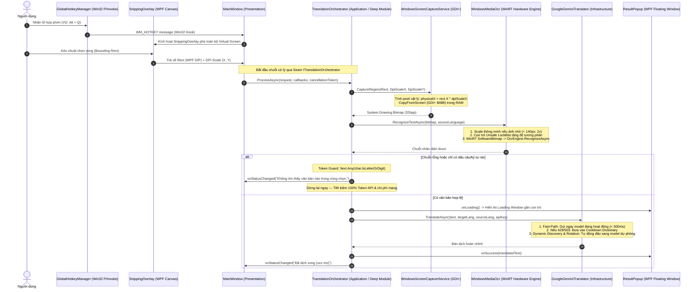

# Cẩm nang Kiến trúc Codebase & Trả lời Phỏng vấn — ScreenTranslator

Tài liệu này được biên soạn dành riêng cho tác giả dự án **ScreenTranslator** nhằm mục đích:
1. Nắm bắt tường tận luồng hoạt động (Architecture & Flow) từ tầng Win32, WinRT, WPF đến LLM Pipeline.
2. Hiểu rõ các quyết định thiết kế theo trường phái **Codebase Design (Deep Modules)** và **Clean Architecture**.
3. Chuẩn bị nội dung đắt giá để đưa vào **CV / Resume**.
4. Bộ câu hỏi phỏng vấn hóc búa kèm câu trả lời mẫu chuẩn Senior .NET / Software Engineer.

---

## 1. Sơ đồ Kiến trúc & Luồng hoạt động Toàn diện (End-to-End Flow)

---

## 2. Các Điểm Sáng Kỹ Thuật (Key Technical Highlights để đưa vào CV)

Khi viết vào CV (phần Projects / Technical Experience), hãy sử dụng các gạch đầu dòng nhấn mạnh vào **giải pháp kỹ thuật** thay vì chỉ nói tính năng chung chung:

* **Kiến trúc Deep Module & Tách Seam (Clean Architecture):** Tách biệt ranh giới rõ ràng giữa UI (WPF), Nghiệp vụ (Deep Module `TranslationOrchestrator`), và Hạ tầng (Win32, WinRT, Gemini REST API). Sử dụng `Microsoft.Extensions.DependencyInjection` làm Composition Root, đạt **100% testability** mà không phụ thuộc vào UI hay môi trường thật.
* **Tối ưu hóa Chi phí & Quota LLM (Resilient AI Pipeline):**
  * **Fast-Path & Dynamic Quota Rotation:** Thiết kế cơ chế tự động xoay vòng model (Model Rotation) khi gặp lỗi `HTTP 429 (Too Many Requests)` hoặc quá tải `503 Service Unavailable`, kết hợp Exponential Cooldown Dictionary để duy trì tính sẵn sàng 99.9% ngay cả khi dùng Free Tier Google AI Studio.
  * **Token Guard (Lọc rác trước khi gọi mạng):** Phân tích ngữ nghĩa kết quả OCR; triệt tiêu hoàn toàn các request rác (chỉ có dấu câu, icon hoặc nhiễu màn hình), tiết kiệm 100% token không cần thiết.
* **Xử lý Hình ảnh & OCR Cấp độ Thấp (Low-level Imaging):**
  * Tận dụng engine OCR tích hợp sẵn của hệ điều hành qua **Windows Runtime (WinRT) Projections**, giảm 50MB dung lượng ứng dụng so với việc đóng gói binary Tesseract.
  * Tăng tốc tiền xử lý hình ảnh (Binarization & Contrast Boosting) bằng khối mã con trỏ trực tiếp (**C# Unsafe `LockBits` pointer manipulation**), đạt tốc độ xử lý chỉ 1-2 ms với 0 heap allocation.
* **Multi-Monitor High-DPI Awareness:** Xử lý chính xác việc ánh xạ tọa độ giữa WPF Device Independent Pixels (DIPs) và Physical Screen Pixels trên cấu hình nhiều màn hình có DPI Scaling khác nhau (VD: 4K 150% + Full HD 100%).
* **Quản lý Tài nguyên Unmanaged & Hủy tác vụ bất đồng bộ:** Áp dụng chuẩn `IDisposable` pattern cho các Win32 Handle (`RegisterHotKey`, `HwndSource`) và điều phối `CancellationTokenSource` để hủy ngay lập tức các HTTP request / OCR in-flight khi người dùng quét màn hình liên tục.

---

## 3. Bộ Câu hỏi & Trả lời Phỏng vấn Kỹ thuật Chuẩn Senior

### Câu 1: "Tại sao bạn chọn WinRT OCR (Windows.Media.Ocr) thay vì Tesseract hay cloud OCR (như Google Cloud Vision)?"
> **Trả lời:**  
> "Tôi đã cân nhắc 3 yếu tố: **Kích thước bộ cài (Bundle size)**, **Tốc độ & Chi phí (Latency & Cost)**, và **Tính riêng tư (Privacy)**.  
> 1. *So với Tesseract:* Tesseract yêu cầu đóng gói kèm thư viện C++ native và các file từ điển ngôn ngữ (`tessdata`), làm dung lượng app tăng thêm từ 40MB - 80MB và tiêu tốn CPU/RAM để khởi tạo. Ngược lại, WinRT OCR tận dụng engine phần cứng đã cài sẵn trong Windows 10/11, dung lượng app giữ nguyên mức siêu nhẹ (chỉ vài megabyte).  
> 2. *So với Cloud OCR:* Cloud OCR có độ chính xác cao nhưng độ trễ mạng từ 300-800ms, tốn chi phí gọi API theo lượt và tiềm ẩn rủi ro lộ dữ liệu nhạy cảm trên màn hình người dùng. WinRT OCR chạy offline 100% trên RAM, tốc độ nhận diện chỉ từ 10-30ms, hoàn toàn miễn phí và bảo mật tuyệt đối."

---

### Câu 2: "Bạn đã giải quyết vấn đề Rate Limit (HTTP 429) và tính sẵn sàng của Gemini API như thế nào?"
> **Trả lời:**  
> "API miễn phí của Google AI Studio thường xuyên gặp lỗi 429 do giới hạn RPM (Requests Per Minute) hoặc RPD (Requests Per Day), và lỗi 503 khi server quá tải. Để giải quyết, tôi xây dựng một **Resilient Pipeline** gồm 3 cơ chế:
> 1. **Fast-Path Caching:** Lưu lại model đã phản hồi thành công gần nhất vào bộ nhớ và cấu hình để gọi trực tiếp (độ trễ < 500ms), tránh gọi dư thừa API thăm dò.
> 2. **Cooldown & Circuit Breaker:** Khi nhận mã lỗi 429 hoặc 503, model đó ngay lập tức bị đưa vào một bảng `ConcurrentDictionary` với thời gian cách ly (cooldown: 60s cho RPM, 4 giờ cho RPD).
> 3. **Dynamic Discovery & Priority Rotation:** Hệ thống tự động truy vấn danh sách các model đang hỗ trợ phương thức `generateContent` từ tài khoản của người dùng, xếp hạng ưu tiên theo phiên bản (Gemini 3.5, 3.6, Flash, Flash-Lite) và tự động trượt (rotate) sang model tốt kế tiếp khi model hiện tại bị khóa."

---

### Câu 3: "Làm thế nào để bạn đảm bảo ứng dụng không bị đơ UI (Freezing) khi người dùng chụp màn hình liên tục?"
> **Trả lời:**  
> "Tôi áp dụng mô hình **Asynchronous Pipeline** kết hợp quản lý **Vòng đời CancellationToken**:
> 1. Toàn bộ các thao tác nặng như chuyển đổi ảnh (`BitmapDecoder.CreateAsync`), OCR (`engine.RecognizeAsync`) và gọi mạng (`HttpClient.SendAsync`) đều là non-blocking async/await và không block luồng WPF Dispatcher.
> 2. Khi người dùng bấm phím tắt chụp liên tiếp, `CancellationTokenSource` cũ sẽ được gọi `.Cancel()` và `.Dispose()` ngay lập tức để ngắt request đang bay trên mạng, ngăn chặn tình trạng cập nhật kết quả đè lên nhau (Race Condition) và tiết kiệm tài nguyên mạng."

---

### Câu 4: "Tại sao bạn lại refactor từ việc viết code trong MainWindow.xaml.cs sang Deep Module TranslationOrchestrator?"
> **Trả lời:**  
> "Ban đầu, `MainWindow.xaml.cs` đóng vai trò là một 'God Class' – vừa bắt event UI, vừa chụp màn hình, vừa gọi OCR, vừa validate chuỗi, vừa xử lý logic retry của LLM. Thiết kế này có 2 nhược điểm chí mạng:
> 1. **Vi phạm Single Responsibility & Rò rỉ phụ thuộc:** UI bị gắn chặt vào hạ tầng phần cứng và mạng.
> 2. **Không thể viết Unit Test:** Muốn kiểm thử xem logic lọc chuỗi rác có chạy đúng không thì bắt buộc phải mở cửa sổ WPF và chụp ảnh thật.  
> 
> Bằng cách trích xuất Deep Module `TranslationOrchestrator` đứng sau Seam `ITranslationOrchestrator`:
> - Interface bên ngoài cực kỳ nhỏ gọn (`ProcessAsync`), đem lại **Leverage** cao cho caller.
> - Toàn bộ độ phức tạp về RAM capture, WinRT OCR, đo đạc Stopwatch và token guard được đóng gói bên trong (**Locality**).
> - Giúp tôi viết được bộ **Unit Test 100% chạy trong RAM** bằng Test Fakes (`FakeOcrEngine`, `FakeTranslator`) với thời gian chạy dưới 150ms mà không cần màn hình hay mạng internet."

---

### Câu 5: "Ứng dụng này xử lý DPI Scaling trên hệ thống nhiều màn hình (Multi-Monitor) ra sao?"
> **Trả lời:**  
> "Trong Windows, toạ độ WPF sử dụng đơn vị Device Independent Pixels (1 DIP = 1/96 inch), trong khi hàm GDI+ `CopyFromScreen` lại yêu cầu toạ độ pixel vật lý (Physical Pixels).  
> Nếu người dùng dùng màn hình 4K scale 150% hoặc laptop scale 125%, toạ độ WPF sẽ bị co lại so với điểm ảnh thực tế.  
> Do đó, tôi dùng `VisualTreeHelper.GetDpi(window)` để lấy chính xác tỉ lệ scale `dpiScaleX` và `dpiScaleY`, sau đó chuyển đổi:
> `physicalX = (int)Math.Round(area.X * dpiScaleX)`  
> `physicalWidth = (int)Math.Round(area.Width * dpiScaleX)`  
> Nhờ đó, ảnh chụp bitmap luôn khớp từng pixel với vùng người dùng đã khoanh trên màn hình, không bị mờ hay lệch chữ."

---

### Câu 6: "Có những nguy cơ Memory Leak nào trong ứng dụng WPF này và bạn đã phòng ngừa ra sao?"
> **Trả lời:**  
> "Có 3 nguy cơ rò rỉ bộ nhớ chính tôi đã xử lý:
> 1. **Win32 Hooks & Window Interop:** `GlobalHotkeyManager` gắn hook vào `HwndSource`. Nếu không tháo hook (`RemoveHook`) và giải phóng Hotkey (`UnregisterHotKey`) khi ứng dụng đóng, Windows handle sẽ bị kẹt lại. Tôi đã áp dụng `IDisposable` và dọn dẹp tại sự kiện `Window.Closing`.
> 2. **GDI+ Bitmaps & Streams:** Đối tượng `Bitmap` và `MemoryStream` nắm giữ bộ nhớ unmanaged. Tôi sử dụng khối `using` triệt để để đảm bảo `bitmap.Dispose()` ngay sau khi OCR trích xuất xong chuỗi.
> 3. **Static Event Leaks:** Không dùng static event để trỏ đến các UI element hoặc ViewModel, vì việc này sẽ ngăn Garbage Collector thu gom các cửa sổ đã đóng."
